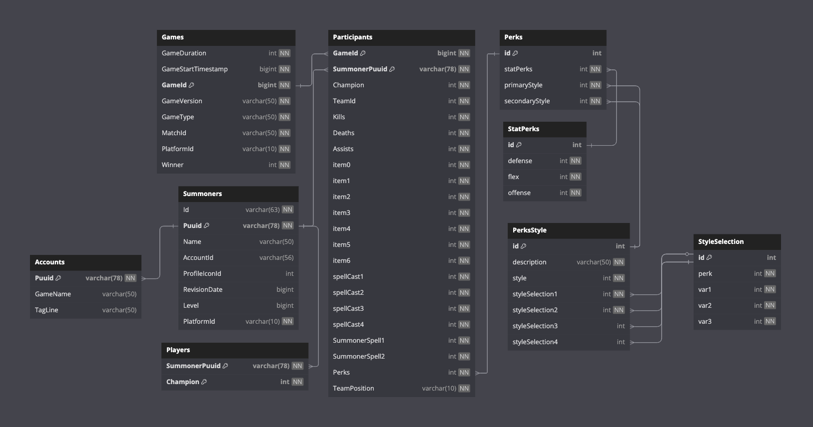

# OTPBUILD

**OTPBUILD** is a backend application designed to analyze League of Legends data by collecting and processing match statistics from high-elo One-Trick-Ponies (OTPs) and professional players.  
Its goal is to provide an accurate and up-to-date database of optimal builds per champion.

Although currently backend-only, OTPBUILD lays the foundation for a future web interface for players to browse top-performing builds and trends.

---

## 🧠 Features

- 🔁 Automatically fetches live match data from Riot Games API (Match-V5, Summoner-V4)
- 📊 Filters and processes games played by Master+ OTPs
- 🛠️ Stores structured match/build data in a MySQL database
- 📉 Highlights champion-specific patterns: items, runes, summoner spells, skill orders
- ⚙️ Designed to be expanded into a complete web platform

---

## 🔧 Technologies

- Language: **C#**
- Framework: [Camille](https://github.com/MingweiSamuel/Camille) – A .NET library for Riot Games API
- APIs: **Riot Games API**
- Database: **MySQL**

---

## 🗺️ Database Schema


------

## 📁 Project Structure

```
.
├── Configurations
│   └── DatabaseConfig.cs
├── Models
│   ├── DatabaseConnection.cs
│   ├── Game.cs
│   ├── GameParticipant.cs
│   └── Player.cs
└── Services
    ├── DatabaseService.cs
    ├── FetchOtps.cs
    └── GameFetcher.cs
```


---

## 🔒 API Usage & Rate Limiting

OTPBUILD is optimized to respect Riot API rate limits:
- Game data is cached locally in MySQL and only refreshed periodically
- Match selection is limited to OTPs in Master+ tiers

Example rate usage:  
`20 requests every 1 second`  
`100 requests every 2 minutes` (current production key limits)

---

## 💡 Project Vision

Soon OTPBUILD will evolve into a full-stack web platform where:
- Players can search by champion and role
- Builds from real high-elo OTPs are displayed
- Trends over time can be visualized

A visual prototype is under consideration.

---

## 📜 License
This project is licensed under the MIT License. See the [LICENSE](LICENSE) file for details.